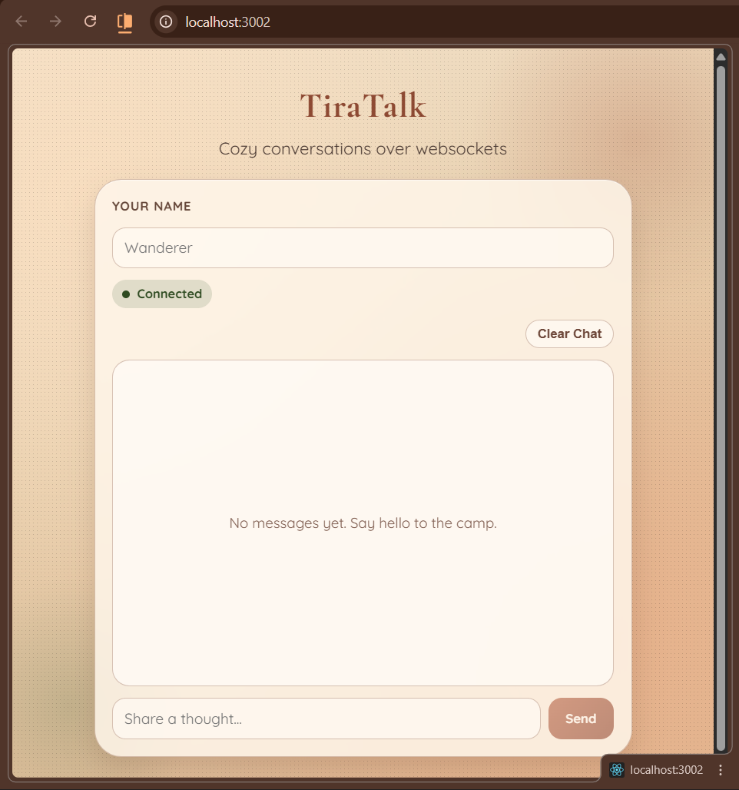
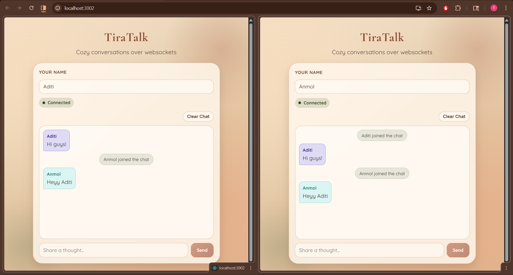
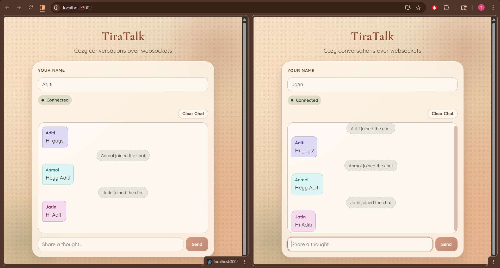
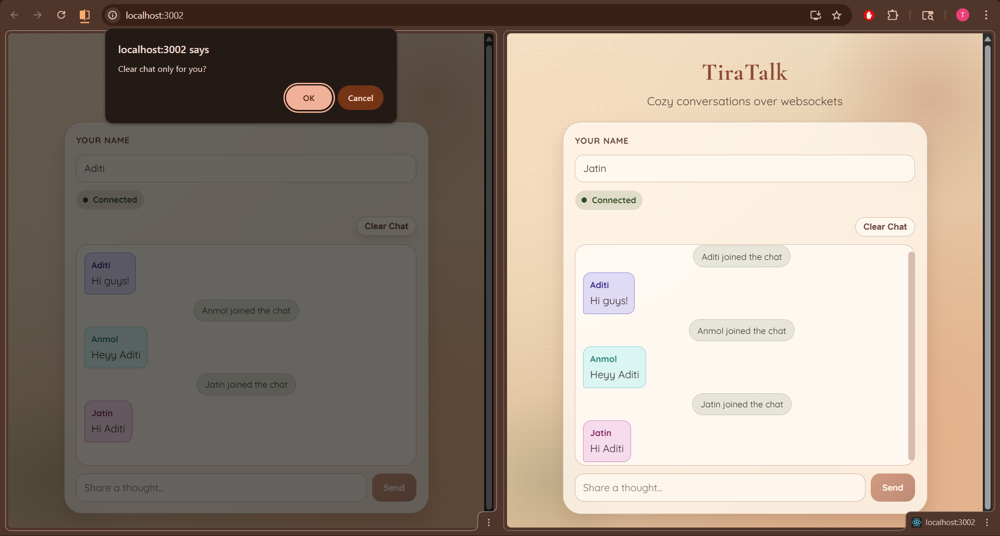
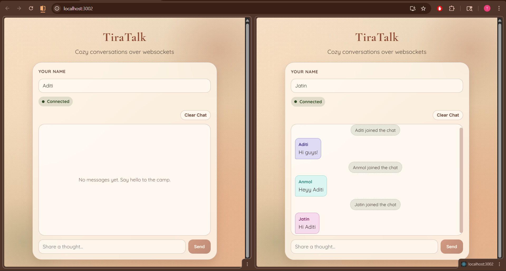

# TiraTalk - WebSocket Chat App

TiraTalk is a React + Spring Boot real-time chat application using SockJS + STOMP. It supports multi-user messaging, join notifications, sender-based color bubbles, server-side history for new users, and a user-local clear chat action.

## Features

- Real-time chat over WebSocket (SockJS + STOMP)
- Sender name with distinct deterministic color per user
- Join notification when a user enters the chat
- Chat history for newly joined users (loaded from backend)
- User-local clear chat button (clears only current user's screen)
- Boho-themed responsive UI

## Tech Stack

- Frontend: React 19, react-scripts 5, SockJS client, STOMP JS
- Backend: Spring Boot 4, Spring WebSocket
- Language: JavaScript (frontend), Java (backend)

## Project Structure

```text
Experiment_10/
├── public/
│   ├── index.html
│   ├── manifest.json
│   ├── robots.txt
│   └── SS/
│       ├── tiratalk-home.png
│       ├── tiratalk-chat-two-users.png
│       ├── tiratalk-chat-three-users.png
│       ├── tiratalk-local-clear-confirm.png
│       └── tiratalk-local-clear-result.png
├── src/
│   ├── App.js
│   ├── App.css
│   ├── index.js
│   ├── index.css
│   └── Components/
│       ├── Chat.jsx
│       ├── MessageInput.jsx
│       └── MessageList.jsx
├── Demo_WebSocket/
│   ├── pom.xml
│   ├── mvnw
│   ├── mvnw.cmd
│   └── src/main/java/com/AML_2B/Demo_WebSocket/
│       ├── Config/WebSocketConfig.java
│       ├── Controller/ChatController.java
│       └── Model/Message.java
├── package.json
└── README.md
```

## Run Backend (Spring Boot)

```powershell
cd Demo_WebSocket
.\mvnw.cmd spring-boot:run
```

Backend runs on `http://localhost:8080`.

## Run Frontend (React)

```powershell
npm install
npm start
```

Frontend runs on `http://localhost:3000` (or next available port).

## WebSocket / API Contract

- SockJS endpoint: `http://localhost:8080/ws`
- Subscribe topic: `/topic/messages`
- Send message destination: `/app/chat`
- Join event destination: `/app/join`
- History API: `GET http://localhost:8080/api/messages`

Message payload shape:

```json
{
  "sender": "Aditi",
  "content": "Hi everyone!",
  "type": "CHAT"
}
```

## Screenshots

### Home / Connected State



### Two Users Chatting



### Multi-user Chat with Join Notifications



### Local Clear Chat Confirmation



### Local Clear Chat Result (Current User Only)



## Notes

- Clear Chat is local-only: it clears messages only in the current user's view.
- Refreshing the page reloads history from backend memory.
- History resets when backend restarts.
