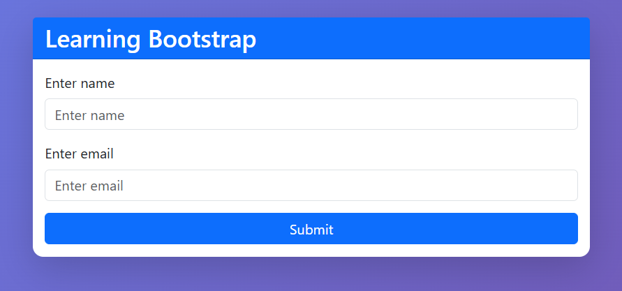
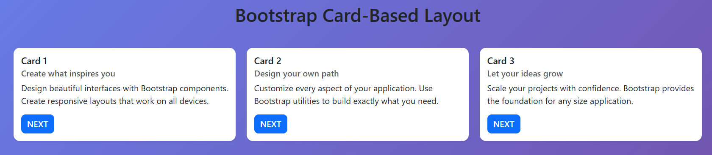
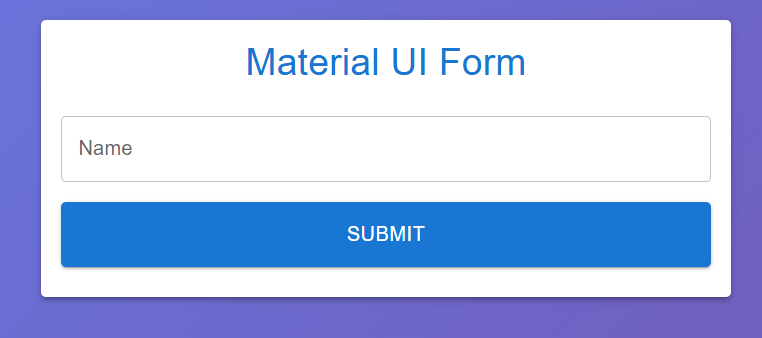
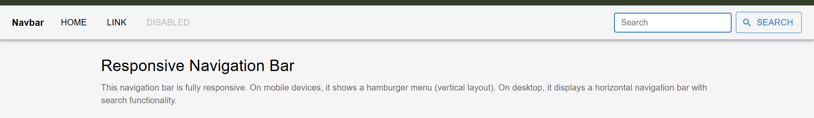

# Experiment 2 - UI Design Using Component Libraries

This folder contains 4 different React applications demonstrating Bootstrap and Material UI components.

## Project Structure

```
Exp_2/
├── 2.1/            # Bootstrap Form Application
├── 2.2/            # Bootstrap Cards Application
├── 2.3/            # Material UI Form Application
└── 2.4/            # Material UI Navbar Application
```

## Applications Overview

### App 1 - Bootstrap Form (Port 5173)
- **Location**: `2.1/`
- **Description**: A responsive form using Bootstrap CSS components
- **Features**:
  - Input validation
  - Form submission handling
  - Bootstrap styling
  - Card-based layout
  

**To run**:
```bash
cd 2.1
npm run dev
```

---

### App 2 - Bootstrap Cards (Port 5174)
- **Location**: `2.2/`
- **Description**: Card-based layout demonstrating Bootstrap grid system
- **Features**:
  - Multiple Bootstrap cards
  - Card carousel/navigation
  - Bootstrap utilities
  - Responsive grid layout
  

**To run**:
```bash
cd 2.2
npm run dev
```

---

### App 3 - Material UI Form (Port 5175)
- **Location**: `2.3/`
- **Description**: A modern form using Material UI components
- **Features**:
  - Material UI TextField components
  - Material UI Button
  - Material UI Card
  - Form validation
  - Material Design principles
  

**To run**:
```bash
cd 2.3
npm run dev
```

---

### App 4 - Material UI Navbar (Port 5176)
- **Location**: `2.4/`
- **Description**: Responsive navigation bar using Material UI
- **Features**:
  - Responsive AppBar
  - Mobile hamburger menu (Drawer)
  - Search functionality
  - Material UI Icons
  - Responsive design
  

**To run**:
```bash
cd 2.4
npm run dev
```

---

## Installation

All dependencies have been installed automatically. Each app includes:
- React 18.3.1
- Vite (for build tooling)
- Bootstrap 5.3.0 (apps 1-2)
- Material UI 5.14.0 (apps 3-4)
- Material UI Icons (app-4)

## Running All Apps Simultaneously

You can run multiple apps at once by opening separate terminals:

```bash
# Terminal 1
cd 2.1 && npm run dev

# Terminal 2
cd 2.2 && npm run dev

# Terminal 3
cd 2.3 && npm run dev

# Terminal 4
cd 2.4 && npm run dev
```

Each app will run on a different port (5173, 5174, 5175, 5176).

## Key Implementations

### Bootstrap Apps (1-2)
- Imported Bootstrap CSS: `import 'bootstrap/dist/css/bootstrap.min.css';`
- Used Bootstrap utilities and components
- Bootstrap Grid System (rows and columns)
- Bootstrap Card components

### Material UI Apps (3-4)
- Imported MUI components: `import { Button, TextField, Card, CardContent } from '@mui/material';`
- Material Design principles
- Emotion for styling (@emotion/react, @emotion/styled)
- Material UI Icons

## Building for Production

To build any app for production:

```bash
cd 2.[1-4]
npm run build
```

Output will be in the `dist/` folder.

---

**Created**: January 2026
**Framework**: React + Vite
**UI Libraries**: Bootstrap 5 & Material UI 5