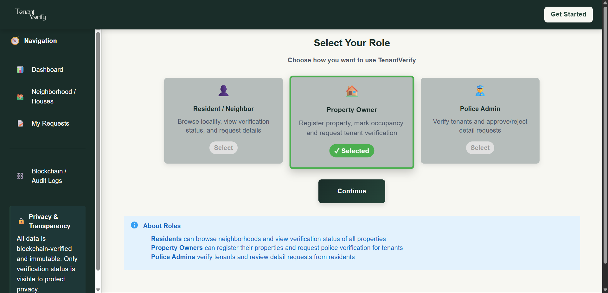
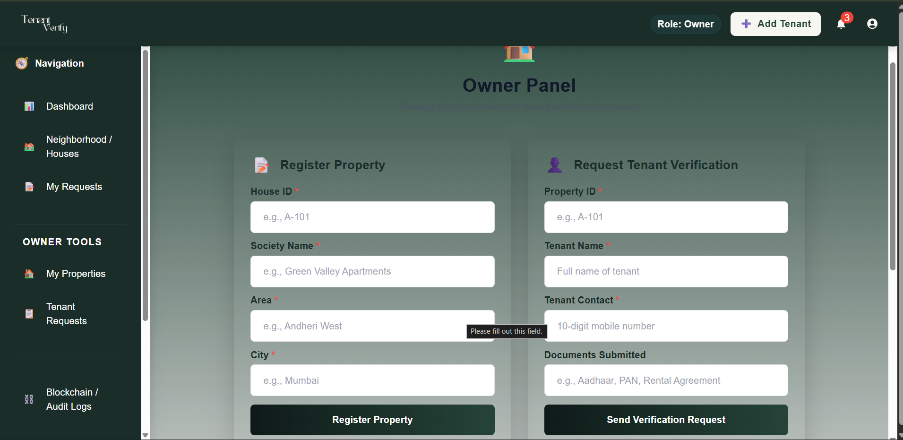
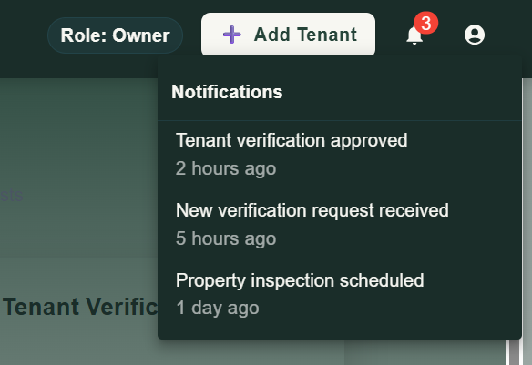
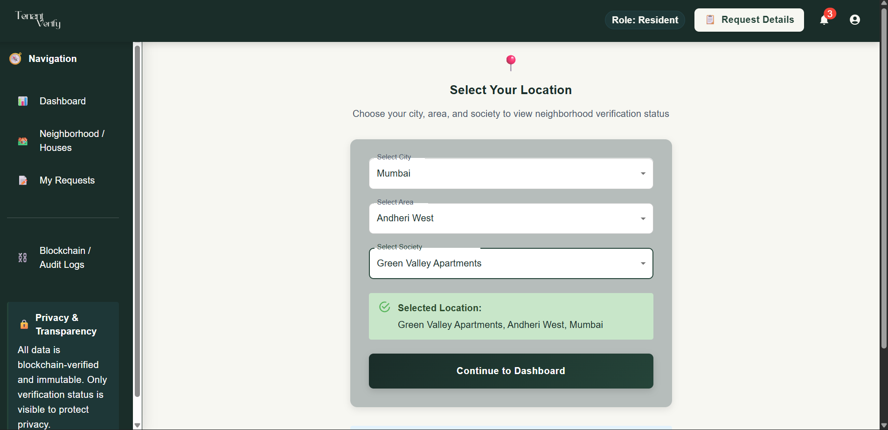
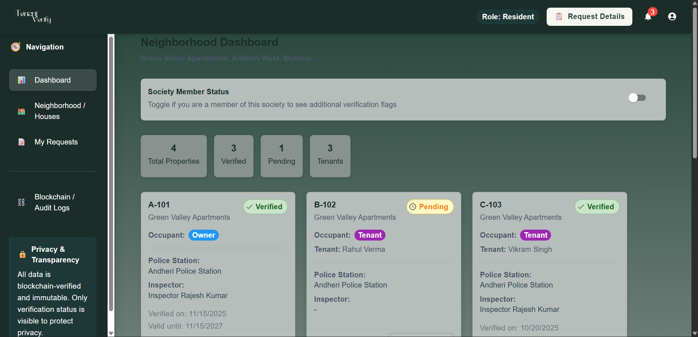

🏘️ TenantVerify

**TenantVerify** is a privacy-first, blockchain-backed tenant verification frontend application designed to enhance neighborhood safety while respecting individual privacy.

The platform allows residents to view **tenant police verification status** in their locality, property owners to request verification for tenants, and police authorities to approve or reject verification and information requests — **without publicly exposing criminal records**.

🔍 Problem Statement

In many neighborhoods, property owners rent out houses to tenants without a transparent and accessible police verification system. Neighbors are often unaware of who is living next door, leading to fear, mistrust, and safety concerns.

At the same time, openly displaying criminal history violates privacy and can lead to misuse.

**TenantVerify bridges this gap** by showing only verification *status*, not personal or criminal details.

💡 Solution Overview

TenantVerify provides:

* City-wide visibility of tenant verification **status**
* Society-level warning flags (**“Some History”**) with controlled access
* Police-controlled approval for detailed information requests
* Blockchain-backed verification proof for transparency and auditability

👥 User Roles

👤 Resident / Neighbor

* View tenant verification status in selected area
* See police station and inspector name
* Request additional details by submitting a reason (subject to police approval)

🏠 Property Owner

* Register properties
* Mark when tenants move in
* Initiate tenant verification requests

👮 Police Admin

* Review tenant verification requests
* Approve or reject verification
* Review and decide on “Demand History Requests”

🔐 Privacy & Security Principles

* ❌ No criminal history is shown publicly
* ✅ Only verification status is visible
* 🏘️ “Some History” flag is visible **only to society members**
* 🧑‍⚖️ Police have full control over approvals
* ⛓️ Blockchain is used to store **verification proof**, not personal data

🧭 Verification Status Logic

| Visibility Scope | Status Shown                    |
| ---------------- | ------------------------------- |
| City-wide users  | Pending, Verified               |
| Society members  | Pending, Verified, Some History |

Verification validity: **24 months**

🚨 Demand History Request Feature

If a resident notices suspicious activity:

1. They can submit a **Demand History Request** with a reason
2. Police review the request
3. Request is either **Approved** or **Rejected**
4. Only approved users receive limited information (frontend mock)

This ensures **controlled disclosure** and prevents misuse.

🖥️ Frontend Features

* Clean, trust-focused UI
* Role-based navigation
* Status badges (Verified / Pending / Some History)
* Notification-ready design
* Sidebar for navigation, Navbar for global actions
* Mock data used (no backend)

🛠️ Tech Stack

* **React**
* **Vite**
* **Tailwind CSS**
* **React Router**
* Mock data (no backend integration)

📁 Project Structure

```
src/
├── components/
│   ├── HouseCard.jsx
│   ├── StatusBadge.jsx
│   └── Navbar.jsx
├── pages/
│   ├── Landing.jsx
│   ├── Auth.jsx
│   ├── AreaSelect.jsx
│   ├── Dashboard.jsx
│   ├── HouseDetails.jsx
│   ├── DemandRequest.jsx
│   ├── OwnerPanel.jsx
│   └── PoliceDashboard.jsx
├── data/
│   └── mockData.js
├── App.jsx
├── main.jsx
└── index.css
```

▶️ Getting Started
1. Install dependencies

npm install

2. Start development server

npm run dev

⚠️ Disclaimer

TenantVerify is a **frontend prototype** created for educational and experimental purposes.
It does not connect to real police databases or blockchain networks.

All verification data is mocked.

💡Screenshots:







🚀 Future Enhancements

* Backend integration (Node.js / Spring Boot)
* Real blockchain integration (Ethereum / Polygon)
* Society membership verification
* Rate-limiting and abuse prevention
* Tenant consent & appeal flow
* Trust score for societies

 📌 Why This Project Stands Out

* Solves a **real-world safety problem**
* Balances **privacy + transparency**
* Demonstrates **product thinking**
* Includes **role-based access control**
* Uses blockchain meaningfully (not buzzword-driven)
