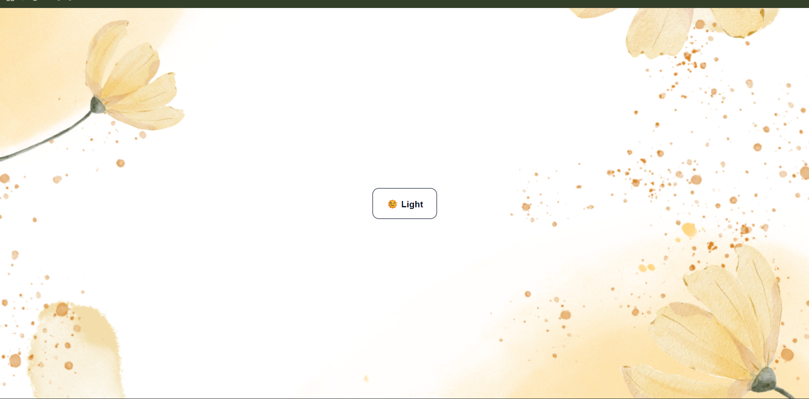
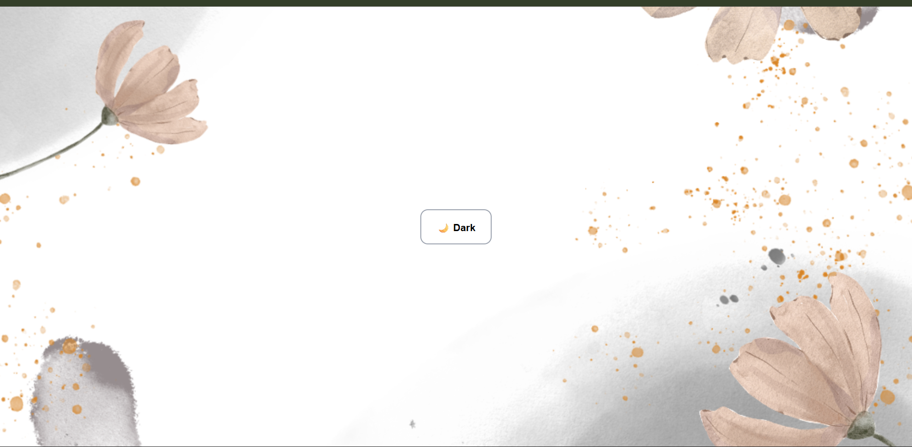

# Experiment 4.1 - Theme Toggle with Background Images

## Overview

This project is a React + Vite app that shows a single centered theme toggle button.

- Light theme uses background image: `BG/1.png`
- Dark theme uses background image: `BG/2.png`

The toggle changes the theme globally using React Context API.

## Folder Structure

- `App.jsx` - Theme context + toggle logic
- `index.css` - Layout, centering, and button styling
- `BG/` - Background images (`1.png`, `2.png`)
- `ss/` - Screenshots for documentation

## Screenshots

### Light Theme



### Dark Theme



## How to Run

```bash
npm install
npm run dev
```

## Build

```bash
npm run build
```
