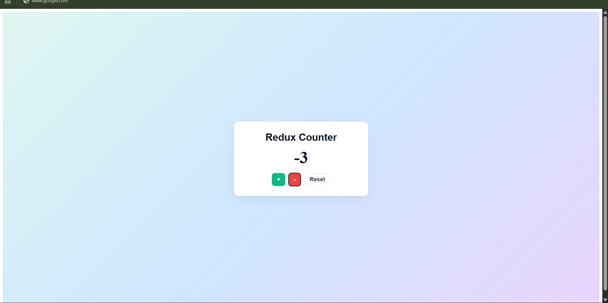
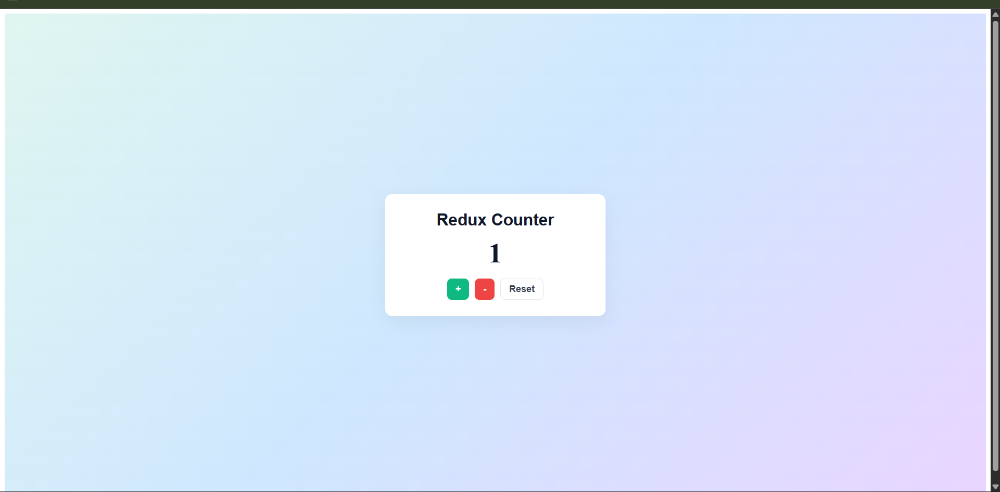

# Experiment 4.2 - Redux Counter Application

## Overview

This project demonstrates centralized state management using Redux Toolkit in a React + Vite app.

- Global counter state is stored in a Redux store.
- `increment`, `decrement`, and `reset` actions update the counter value.
- UI uses `useSelector` to read state and `useDispatch` to trigger actions.

## About Redux

Redux is a predictable state management library for JavaScript applications.

- **Store**: A single centralized object that holds app state.
- **Action**: A plain object that describes what happened (for example, increment counter).
- **Reducer**: A function that receives current state + action and returns updated state.
- **Dispatch**: The method used to send actions to the store.

In this project, Redux helps keep counter logic centralized and easy to scale when the app grows. Redux Toolkit is used to reduce boilerplate and make reducers/actions cleaner.

## Files

- `App.jsx` - Counter UI and Redux hooks integration
- `store.js` - Redux Toolkit slice, actions, and store configuration
- `index.css` - Styling for the counter card and action buttons
- `ss/` - Output screenshots

## Screenshots

### Screenshot 1



### Screenshot 2



## How to Run

```bash
npm install
npm run dev
```

## Build

```bash
npm run build
```
