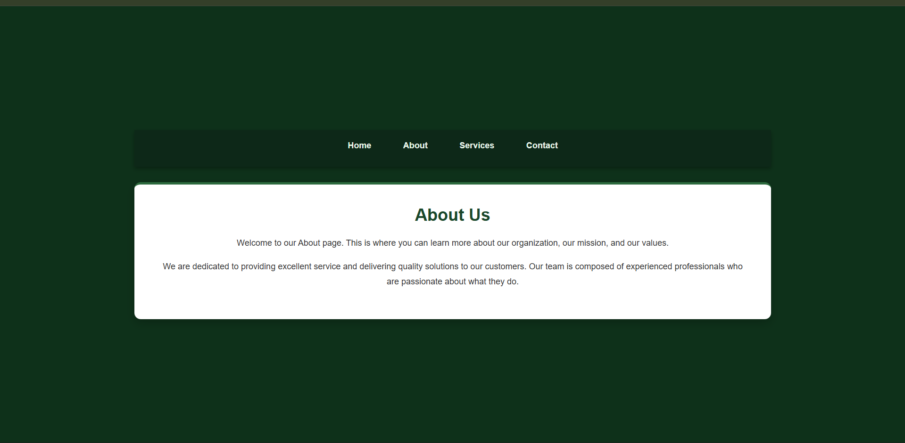
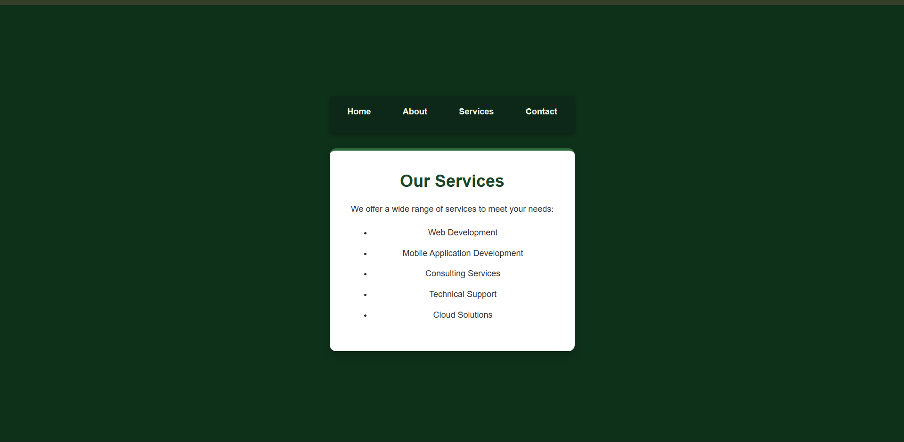

# Experiment 5.2: Small App — Form & State

## Aim

To build a small React form-driven application that captures user input and displays it; practice controlled components and basic local state.

## Software Requirements

- Node.js
- React
- Code Editor (VS Code)
- Web Browser

## Theory

Controlled components in React keep form element values in state, making it easier to validate, submit, or preview input. This experiment practices wiring inputs to state and rendering results.

## Procedure

1. Create a form component with inputs (text, email, textarea).
2. Manage input values with `useState` and controlled inputs.
3. Validate basic rules (required fields, simple format).
4. On submit, render a preview card showing the submitted values.

## What to deliver

- `App.jsx` with a working form, validation and preview.
- `index.css` with simple styles for form and preview.
- README with run steps (this file).

## Run

```bash
cd Experiment_5/5.2
npm install
npm run dev
```

Open the URL shown by Vite in your browser.

## Screenshot






# React + Vite

This template provides a minimal setup to get React working in Vite with HMR and some ESLint rules.

Currently, two official plugins are available:

- [@vitejs/plugin-react](https://github.com/vitejs/vite-plugin-react/blob/main/packages/plugin-react) uses [Babel](https://babeljs.io/) (or [oxc](https://oxc.rs) when used in [rolldown-vite](https://vite.dev/guide/rolldown)) for Fast Refresh
- [@vitejs/plugin-react-swc](https://github.com/vitejs/vite-plugin-react/blob/main/packages/plugin-react-swc) uses [SWC](https://swc.rs/) for Fast Refresh

## React Compiler

The React Compiler is not enabled on this template because of its impact on dev & build performances. To add it, see [this documentation](https://react.dev/learn/react-compiler/installation).

## Expanding the ESLint configuration

If you are developing a production application, we recommend using TypeScript with type-aware lint rules enabled. Check out the [TS template](https://github.com/vitejs/vite/tree/main/packages/create-vite/template-react-ts) for information on how to integrate TypeScript and [`typescript-eslint`](https://typescript-eslint.io) in your project.
